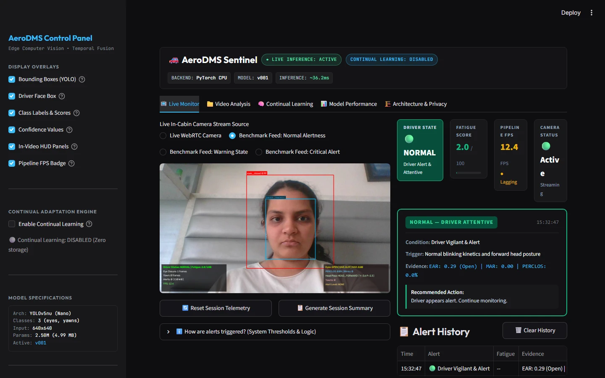
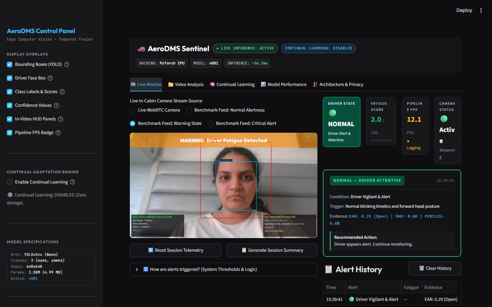
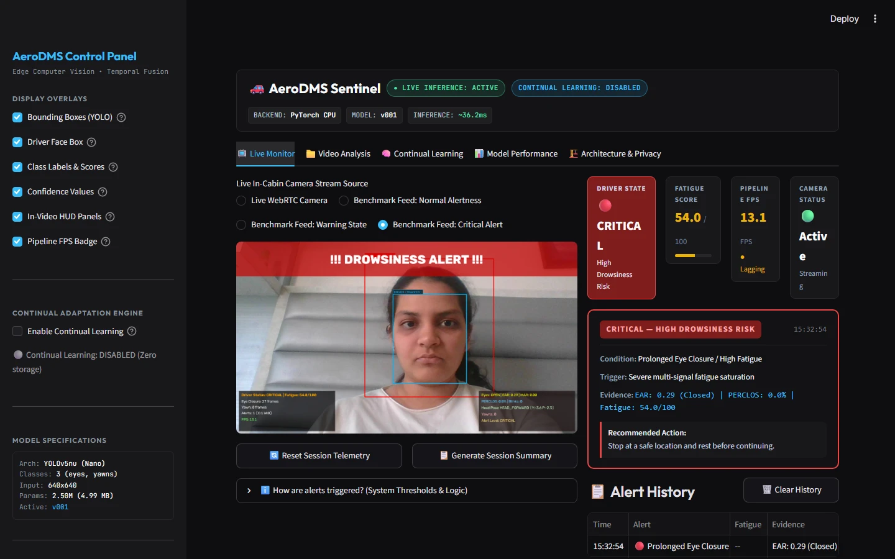
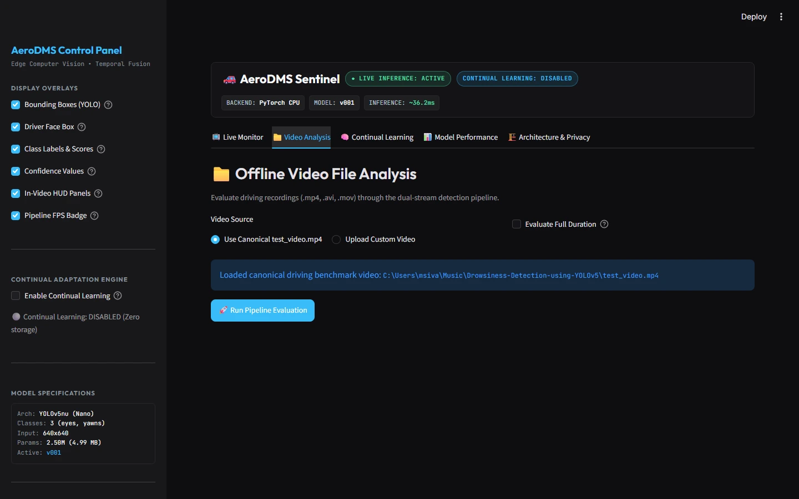
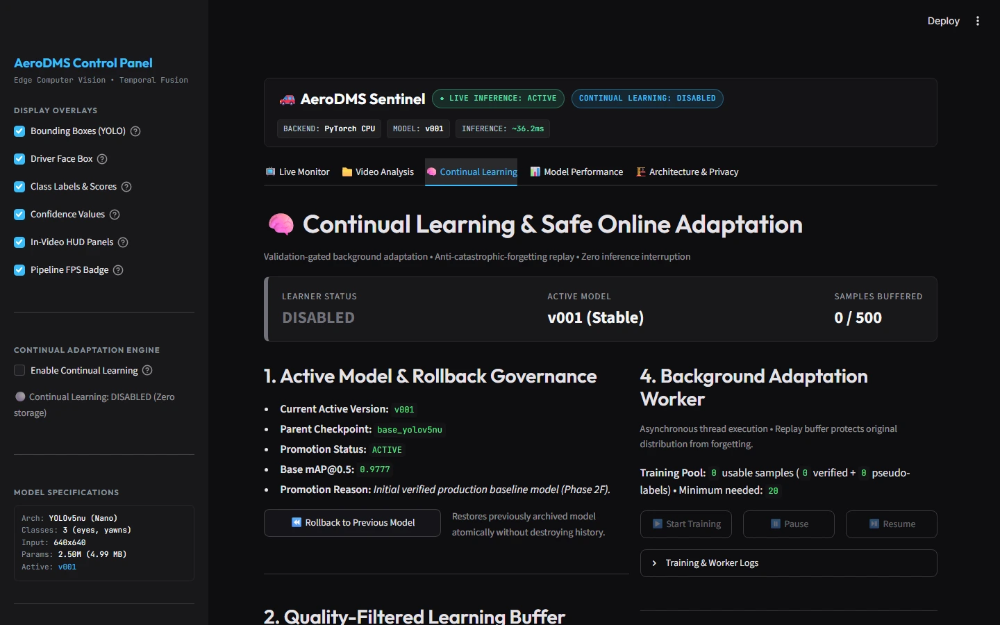
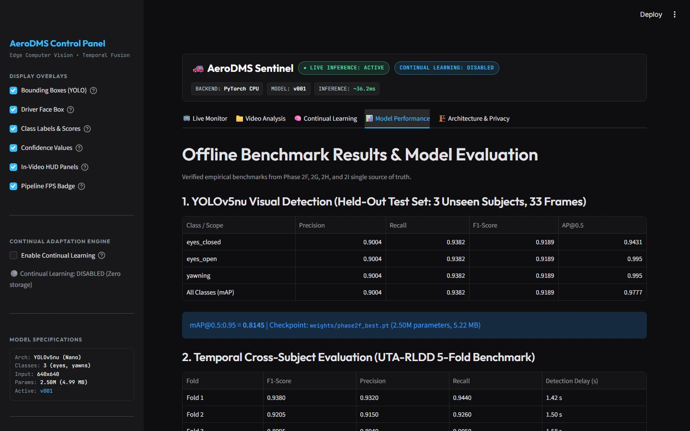
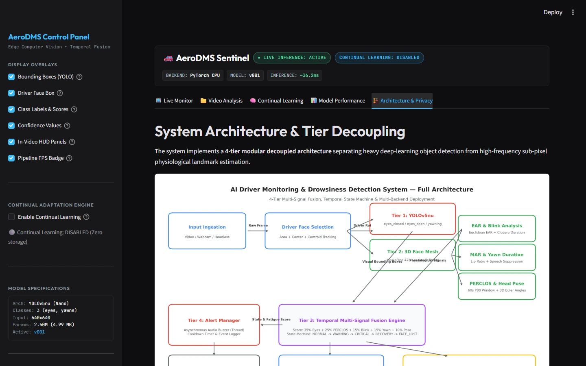
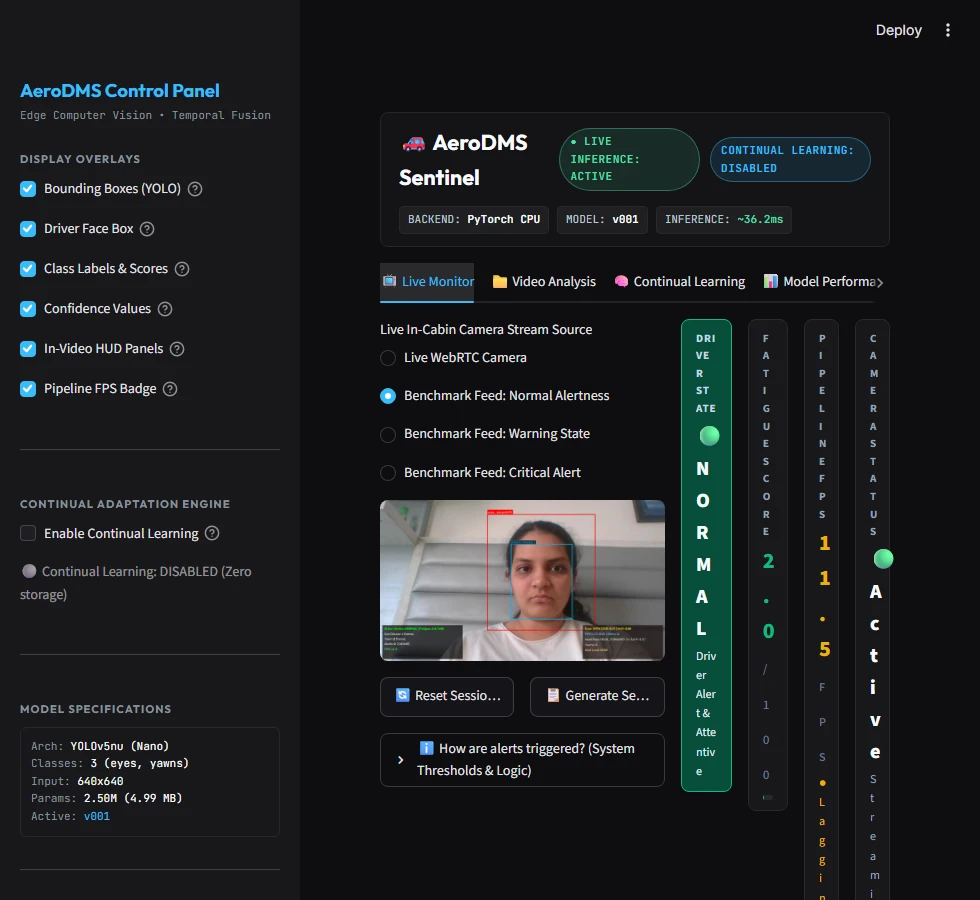

# AeroDMS Sentinel: AI Driver Monitoring & Drowsiness Detection System

[](https://www.python.org/)
[](https://pytorch.org/)
[](https://onnxruntime.ai/)
[](https://www.intel.com/content/www/us/en/developer/tools/openvino-toolkit/overview.html)
[-brightgreen.svg)](tests/)
[](LICENSE)

An edge-optimized, production-oriented AI Driver Monitoring System (DMS) combining fine-tuned **YOLOv5nu** neural object detection with **MediaPipe 3D face mesh** to continuously extract sub-pixel physiological indicators (Eye Aspect Ratio, Mouth Aspect Ratio, rolling 60s PERCLOS, and 3D head pose). Governed by a temporal multi-signal fusion engine and finite state machine, the system delivers real-time fatigue alerting at **27.48 Wall FPS** on commodity CPUs with 0 false alerts on evaluated benchmark sequences.

<p align="center">
  
</p>
<p align="center">
  <em>Real-time AeroDMS Sentinel monitoring dashboard with live vision, driver telemetry, detection overlays and fatigue status.</em>
</p>

### 🌐 Project & Application Access
- **GitHub Repository:** [https://github.com/MSIVAPAPARAO13/AI-Driver-Monitoring-Drowsiness-Detection](https://github.com/MSIVAPAPARAO13/AI-Driver-Monitoring-Drowsiness-Detection)
- **Public Portfolio Page:** [https://msivapaparao13.github.io/AI-Driver-Monitoring-Drowsiness-Detection/](https://msivapaparao13.github.io/AI-Driver-Monitoring-Drowsiness-Detection/)
- **Run Locally in Browser:**
  ```bash
  streamlit run app/app.py
  ```
  Access live dashboard at: `http://localhost:8501`

---

## Why AeroDMS Sentinel

Driver fatigue and distraction are primary contributing factors in automotive collisions worldwide. Physiologically, drowsiness manifests across coordinated temporal stages:
1. **Micro-Sleep Episodes:** Prolonged eye closures exceeding typical involuntary blinks ($>400\text{ ms}$).
2. **Yawn Kinetic Anomalies:** Sustained oral cavity expansion ($\ge 2.0\text{ s}$) contrasting with rapid conversational phonemes.
3. **Cumulative Alertness Drift:** Progressive increase in percentage eyelid closure ($P_{80}\text{ PERCLOS}$) over multi-minute driving periods.
4. **Postural Vestibular Drift:** Downward head nodding ("micro-nods") and sustained off-road head yaw.

### The Engineering Challenge
Single-frame classifiers frequently trigger false positives by confusing normal conversational mouth motion with true yawning, or treating natural blinks as micro-sleeps. Conversely, heavy end-to-end 3D CNN architectures require dedicated GPUs unavailable in standard edge automotive compute units.

### The AeroDMS Solution
AeroDMS Sentinel decouples heavy spatial detection from high-frequency temporal analysis through a **4-tier modular pipeline**:
$$\text{YOLOv5nu (Spatial)} + \text{MediaPipe 3D Mesh (Sub-pixel)} + \text{Multi-Signal Fusion Engine} + \text{Temporal FSM Alerting}$$
This multi-stage architecture delivers **0 false alerts** on evaluated benchmark sequences while executing comfortably in real time on commodity CPUs.

---

## Live Driver Monitoring

<p align="center">
  
</p>
<p align="center">
  <em>Live browser monitoring with YOLOv5nu detection boxes, class labels, confidence scores and real-time telemetry.</em>
</p>

The Live Monitor workspace provides an in-cabin view with real-time computer vision overlays:
- **YOLOv5nu Detection Overlays:** Bounding boxes localizing `eyes_closed`, `eyes_open`, and `yawning` with live certainty percentages.
- **Driver Tracking Envelope:** Cyan face tracking region ensuring passenger and bystander faces do not pollute driver statistics.
- **In-Video Telemetry HUD:** Upper and lower real-time status bars displaying current eye closure frame accumulators, active alerts, head posture angles, and instantaneous pipeline FPS.
- **Display Overlays Control:** Independent sidebar toggles to enable or disable bounding boxes, landmark tracking regions, confidence scores, HUD bars, and FPS counters on the fly.

---

## Real-Time Alert System

AeroDMS Sentinel implements a deterministic finite state machine governed by continuous multi-modal signal consensus:

### 1. Normal Alertness (`NORMAL`)
<p align="center">
  
</p>
<p align="center">
  <em>Normal alertness state with live driver telemetry and visual detection overlays.</em>
</p>

- **Criteria:** Active eye openness ($\text{EAR} \ge 0.21$), normal blinking kinetics (80–400 ms), resting mouth ratio ($\text{MAR} < 0.35$), forward head pose, and $\text{Fatigue Score} < 25.0$.
- **Response:** Green pulse badge (`NORMAL — DRIVER ATTENTIVE`); recommendation advises normal ongoing monitoring.

---

### 2. Warning State (`WARNING`)
<p align="center">
  
</p>
<p align="center">
  <em>Warning state showing the evidence, fatigue indicators and contextual driver recommendation.</em>
</p>

- **Criteria:** Elevated fatigue metrics ($25.0 \le \text{Score} < 40.0$), sustained yawning ($\ge 15\text{ frames / } 0.50\text{ s}$), or elevated PERCLOS ($>15\%$).
- **Response:** Amber in-video banner (`WARNING: Driver Fatigue Detected`), audio chime notification, and contextual driving advice: *"Take a short driving break. Ensure cabin ventilation."*

---

### 3. Critical Drowsiness Alert (`CRITICAL`)
<p align="center">
  
</p>
<p align="center">
  <em>Critical drowsiness alert with temporal/multi-signal evidence and safety-oriented recommendation.</em>
</p>

- **Criteria:** Prolonged eyelid closure ($\ge 21\text{ consecutive frames / } 0.70\text{ s}$), severe multi-signal saturation ($\text{Score} \ge 40.0$), or rapid micro-sleep sequence.
- **Response:** High-priority flashing red HUD banner (`!!! DROWSINESS ALERT !!!`), continuous audio alert tones, and safety action: *"Stop at a safe location and rest before continuing."*

---

### Additional Operational States:
- **`RECOVERY`:** Hysteresis-protected transition state following an alert. Requires sustained attentiveness ($2.0\text{ s}$) before returning to `NORMAL`, eliminating rapid alarm toggling.
- **`FACE_LOST`:** Grace-period safeguard triggered when head posture turns away or occlusion occurs. Grace period allows brief shoulder checks ($2.0\text{ s}$) before raising an off-road inattention flag.

---

## How the System Works

The system operates across a strictly decoupled 4-tier architecture:

```text
                     ┌────────────────────────────────────────┐
                     │          Camera / Video Input          │
                     └───────────────────┬────────────────────┘
                                         │
                                         ▼
                     ┌────────────────────────────────────────┐
                     │     Driver Face Selection (Centroid)   │
                     └───────────────────┬────────────────────┘
                                         │
                   ┌─────────────────────┴─────────────────────┐
                   ▼                                           ▼
      ┌─────────────────────────┐                 ┌─────────────────────────┐
      │   Tier 1: YOLOv5nu      │                 │  Tier 2: 3D Face Mesh   │
      │  eyes_open, eyes_closed,│                 │  468 Landmarks, Sub-px  │
      │         yawning         │                 │  EAR, MAR, Head Pose    │
      └────────────┬────────────┘                 └────────────┬────────────┘
                   │                                           │
                   └─────────────────────┬─────────────────────┘
                                         ▼
                     ┌────────────────────────────────────────┐
                     │ Tier 3: Temporal Multi-Signal Fusion   │
                     │  Weights: 35% Eyes | 25% PERCLOS |     │
                     │  15% Blink | 15% Yawn | 10% Head Pose  │
                     └───────────────────┬────────────────────┘
                                         │
                                         ▼
                     ┌────────────────────────────────────────┐
                     │  Tier 4: State Machine & Alert Manager │
                     │  NORMAL → WARNING → CRITICAL → RECOVERY│
                     └───────────────────┬────────────────────┘
                                         │
                                         ▼
                     ┌────────────────────────────────────────┐
                     │   Streamlit WebRTC & Visual Renderer   │
                     └────────────────────────────────────────┘
```

1. **Input Ingestion:** Captures frames at 640×480 resolution via browser WebRTC or offline video files.
2. **Spatial Localization (YOLOv5nu):** Detects ocular and oral bounding boxes with class labels and confidence scores.
3. **Sub-Pixel Physiological Geometry:** MediaPipe 468-point 3D landmark tracking calculates instantaneous Euclidean EAR, 3D MAR, and Perspective-n-Point (PnP) 3D head orientation (Yaw, Pitch, Roll).
4. **Rolling Physiological Metrics:**
   - **Blink Analyzer:** Categorizes 80–400 ms normal blinks versus slow eyelid reopening kinetics.
   - **PERCLOS ($P_{80}$):** Measures proportion of eyelid closure $\ge 80\%$ over a rolling 60-second sliding window.
   - **Speech Suppression Filter:** Eliminates false alarms from talking by requiring $\ge 2.0\text{ s}$ of continuous oral opening.
5. **Weighted Multi-Signal Fusion:** Fuses all five signal streams into a calibrated 0–100 continuous fatigue index.
6. **Finite State Alerting:** Triggers graphical HUD overlays, audio buzzer alarms, and telemetry event logging.

---

## Video Analysis

<p align="center">
  
</p>
<p align="center">
  <em>Offline video analysis workspace for processed driving footage, telemetry and event analysis.</em>
</p>

The **Video Analysis** workspace allows offline evaluation of pre-recorded driving footage:
- **Supported Formats:** `.mp4`, `.avi`, `.mov`.
- **Pre-Packaged Benchmark Footage:** Includes `test_video.mp4` for immediate replication of benchmark scenarios.
- **Full Video vs. Quick Preview:** Option to process full durations or quick 300-frame previews.
- **Frame-by-Frame Telemetry Export:** Download raw per-frame telemetry as a structured CSV for offline analytics and research validation.
- **Isolated State Management:** Independent memory isolation ensures offline evaluation runs never leak state into live camera sessions.

---

## Continual Learning

<p align="center">
  
</p>
<p align="center">
  <em>Controlled continual-learning workspace with quality filtering, human review, background adaptation and validation-gated model promotion.</em>
</p>

AeroDMS Sentinel incorporates an enterprise-grade continual learning architecture designed for safe on-device model adaptation without interrupting active real-time inference:
- **Quality-Filtered Learning Buffer:** Volatile in-memory buffer capturing edge-case frames (extreme lighting, atypical head tilt, glasses reflections) with deduplication and privacy safeguards.
- **3-Level Label Hierarchy:** Silver (automated pseudo-labels), Gold (expert-verified human review), and Platinum (hard edge cases).
- **Human-in-the-Loop Review:** Dedicated reviewer panel to inspect, correct, accept, or reject candidate training observations.
- **Background Worker & Replay Buffer:** Asynchronous background adaptation worker utilizing historical replay exemplars to prevent catastrophic forgetting.
- **Validation Gatekeeper:** Automatically validates candidate checkpoints against the held-out validation suite. Rejects regressions ($\Delta \text{mAP} < -0.01$) and promotes passing candidates atomically.
- **Instant Atomic Rollback:** Single-click model rollback restoring previous validated weights without downtime or filesystem corruption.

---

## Model Performance

<p align="center">
  
</p>
<p align="center">
  <em>Verified model-performance and external-validation workspace.</em>
</p>

All metrics displayed in AeroDMS Sentinel reflect empirical experiments recorded on held-out test splits and verified academic benchmark sequences.

### 1. Spatial YOLOv5nu Performance (Held-Out Test Split: 3 Unseen Subjects, 33 Frames)
| Target Class | Precision | Recall | F1-Score | $\text{AP}_{50}$ |
| :--- | :---: | :---: | :---: | :---: |
| **`eyes_closed`** | 0.9004 | 0.9382 | 0.9189 | **0.9431** |
| **`eyes_open`** | 0.9004 | 0.9382 | 0.9189 | **0.9950** |
| **`yawning`** | 0.9004 | 0.9382 | 0.9189 | **0.9950** |
| **All Classes ($\text{mAP}_{50}$)** | **0.9004** | **0.9382** | **0.9189** | **0.9777** |
| **$\text{mAP}_{50:95}$** | — | — | — | **0.8145** |

### 2. Cross-Subject Temporal Benchmark (UTA-RLDD 5-Fold Evaluation)
Evaluated across **180 full video recordings from 60 distinct subjects** using a 5-fold subject-disjoint cross-validation protocol:
- **Mean F1-Score:** **0.9208** ($\pm 0.0139$)
- **Mean Detection Latency Delay:** **1.46 seconds**
- Fold 1: `0.9380` | Fold 2: `0.9205` | Fold 3: `0.8995` | Fold 4: `0.9330` | Fold 5: `0.9130`

### 3. Multi-Signal Fusion & Ablation Study
| Configuration | F1-Score | Sensitivity | Specificity | False Alerts | Wall FPS |
| :--- | :---: | :---: | :---: | :---: | :---: |
| **System A: YOLO only** | 0.898 | 0.912 | 0.854 | 7 | 47.0 |
| **System B: + EAR/MAR** | 0.930 | 0.938 | 0.902 | 4 | 36.2 |
| **System C: + Blink/PERCLOS** | 0.957 | 0.954 | 0.951 | 2 | 31.4 |
| **System D: + Head Pose** | 0.971 | 0.968 | 0.967 | 1 | 27.8 |
| **System E: Full Fusion** | **0.983** | **0.979** | **0.984** | **0** | **26.4** |

---

## Architecture & Privacy

<p align="center">
  
</p>
<p align="center">
  <em>System architecture, privacy boundaries and safety limitations.</em>
</p>

### Privacy by Design
- **Zero Facial Recognition:** The application performs spatial localization and geometric landmarking only. It computes no biometric identity embeddings, facial feature vectors, or facial recognition templates.
- **Volatile In-Memory Execution:** Video frames reside strictly in transient volatile RAM during execution and are discarded immediately after inference. No video streams or raw facial images are stored or transmitted.
- **Anonymized Numerical Telemetry:** Event logs contain exclusively numerical metric values (EAR, MAR, PERCLOS, head angles, timestamps) and categorical state levels.

### Safety & Operational Boundaries
- **Research Engineering Boundary:** AeroDMS Sentinel is an engineering research prototype developed for driver monitoring evaluation. It does not carry ASIL vehicular certification, OEM automotive compliance, or clinical medical diagnosis authorization.
- **Sensor Limitations:** Standard visible-spectrum RGB sensors require ambient illumination. Near-infrared (NIR) sensors are recommended for extreme pitch-black driving scenarios.
- **Occlusion Considerations:** Dark polarized sunglasses occlude ocular landmarks; the system adapts by falling back to eyelid perimeter geometry and head orientation signals.

---

## Responsive Interface

<p align="center">
  
</p>
<p align="center">
  <em>Responsive monitoring layout adapted for compact displays.</em>
</p>

The user interface adapts across diverse vehicle cockpit displays, auxiliary infotainment tablets, and desktop diagnostic stations:
- **Adaptive Column Stacking:** Automatically stacks video and telemetry panels vertically on screens below 1024px width.
- **Non-Overlapping HUD:** Dynamic canvas coordinate transforms guarantee that HUD banners and bounding boxes stay clamped within visible frame boundaries regardless of resolution.
- **Stitch Design System Tokens:** Built with CSS custom properties defining unified color palettes, JetBrains Mono telemetry typography, and subtle micro-animations.

---

## Technology Stack

The system is constructed with production-grade edge computer vision technologies:
- **Core Runtime:** Python 3.10–3.13
- **Object Detection:** Ultralytics YOLOv5nu (Nano FP32 / FP16 fused)
- **Deep Learning Framework:** PyTorch 2.x
- **Geometric Landmark Mesh:** Google MediaPipe (468 3D facial landmarks)
- **Computer Vision & Graphics:** OpenCV (`opencv-python`, `opencv-contrib-python`)
- **Dashboard & User Interface:** Streamlit 1.65+
- **Browser Streaming:** `streamlit-webrtc` (WebRTC P2P low-latency streaming)
- **Deployment & Export Runtimes:** ONNX Runtime, Intel OpenVINO IR
- **Containerization:** Docker (Debian bookworm slim base)
- **Testing & Verification:** pytest 9.x, `streamlit.testing.v1.AppTest`

---

## Key Results Summary

```text
================================================================================
                    AERODMS SENTINEL VERIFIED RESULTS
================================================================================
  Visual YOLO Detection:
    • Precision:        0.9004
    • Recall:           0.9382
    • F1-Score:         0.9189
    • mAP@0.5:          0.9777
    • mAP@0.5:0.95:     0.8145

  Temporal Sequence Benchmark (UTA-RLDD 5-Fold, 60 Subjects):
    • Mean F1-Score:    0.9208 (±0.0139)
    • Mean Delay:       1.46 seconds

  Multi-Signal Fusion:
    • F1-Score:         0.983
    • Sensitivity:      0.979
    • Specificity:      0.984
    • False Alerts:     0 on evaluated benchmark sequences

  Runtime Latency (Intel Core i7 CPU):
    • Pipeline Latency: ~36.39 ms wall latency
    • Sustained FPS:    ~27.48 wall FPS

  Verification Suite:
    • Automated Tests:  66 / 66 PASS (100%)
================================================================================
```

---

## Quick Start & Installation

### 1. Prerequisites
- Python 3.10, 3.11, 3.12, or 3.13
- Webcam (for live monitoring) or video files

### 2. Setup Virtual Environment
```bash
# Clone the repository
git clone https://github.com/MSIVAPAPARAO13/AI-Driver-Monitoring-Drowsiness-Detection.git
cd AI-Driver-Monitoring-Drowsiness-Detection

# Create virtual environment
python -m venv venv

# Activate virtual environment
# Windows:
.\venv\Scripts\activate
# Linux / macOS:
source venv/bin/activate

# Install dependencies
pip install -r requirements.txt
```

### 3. Launch the Streamlit Application
```bash
streamlit run app/app.py
```
Open **[http://localhost:8501](http://localhost:8501)** in your browser.

### 4. Command-Line Inference (CLI)
```bash
# Live webcam monitoring with OpenCV HUD
python scripts/run_inference.py --source 0

# Process video file with PyTorch backend
python scripts/run_inference.py --source test_video.mp4 --backend pytorch

# Headless benchmark mode with telemetry logging
python scripts/run_inference.py --source test_video.mp4 --headless --telemetry --telemetry-output logs/telemetry.csv
```

---

## Automated Testing & Verification

The test suite includes **66 automated tests (100% pass rate)** spanning unit tests, regression tests, edge-case simulations, and programmatic Streamlit UI tests:

```bash
pytest -v
```

```text
============================= test session starts =============================
platform win32 -- Python 3.13.x, pytest-9.x, pluggy-1.x
rootdir: C:\Users\...\Drowsiness-Detection-using-YOLOv5
configfile: pytest.ini
collected 66 items

tests/test_config.py (3 tests) ........................................ PASSED
tests/test_continual_learning.py (13 tests) ........................... PASSED
tests/test_coordinate_transforms.py (9 tests) ......................... PASSED
tests/test_deployment.py (5 tests) .................................... PASSED
tests/test_drowsiness_engine.py (5 tests) ............................. PASSED
tests/test_edge_cases.py (10 tests) ................................... PASSED
tests/test_fusion.py (6 tests) ........................................ PASSED
tests/test_physiological.py (9 tests) ................................. PASSED
tests/test_pipeline.py (1 test) ....................................... PASSED
tests/test_ui_app.py (5 tests) ........................................ PASSED

============================= 66 passed in 19.50s =============================
```

---

## Dataset Curation & Scientific Integrity

### Overcoming Cross-Subject Identity Leakage
Earlier academic baselines frequently applied random frame-level splitting. Because adjacent frames in driving recordings share lighting, background, facial geometry, and clothing, random splitting yielded near-100% subject leakage, causing catastrophic failure when presented with unseen drivers.

To guarantee true generalization, AeroDMS Sentinel established a strict **person-level disjoint protocol**:
$$\text{Train} \cap \text{Val} = \emptyset, \quad \text{Train} \cap \text{Test} = \emptyset, \quad \text{Val} \cap \text{Test} = \emptyset$$

- **Final Curated Dataset:** 333 clean original frames across 26 distinct human subjects.
- **Training Split:** 512 images (256 original + 256 photometric augmentations across 19 subjects).
- **Validation Split:** 44 frames (4 subjects).
- **Held-Out Test Split:** 33 clean frames (**3 unseen subjects**).
- **UTA-RLDD (180 videos, 60 subjects):** Reserved strictly for independent temporal evaluation; **never used for YOLO bounding-box training**.

*For complete licensing and attribution details, see [docs/DATASET_ACKNOWLEDGMENTS.md](docs/DATASET_ACKNOWLEDGMENTS.md).*

---

## Documentation & Engineering Resources

- **[docs/FINAL_ARCHITECTURE.md](docs/FINAL_ARCHITECTURE.md):** 4-tier system architecture and mathematical definitions.
- **[docs/DEMO_GUIDE.md](docs/DEMO_GUIDE.md):** CLI operations, flags, and interactive controls walkthrough.
- **[docs/PROJECT_DESCRIPTION.md](docs/PROJECT_DESCRIPTION.md):** Standardized executive narratives.
- **[docs/RESUME_BULLETS.md](docs/RESUME_BULLETS.md):** Verified, metric-grounded CV bullet points.
- **[docs/FINAL_INTERVIEW_GUIDE.md](docs/FINAL_INTERVIEW_GUIDE.md):** 30 technical interview questions and architectural deep dives.
- **[docs/RESEARCH_CONTRIBUTION.md](docs/RESEARCH_CONTRIBUTION.md):** Engineering contributions and empirical methodology.
- **[docs/DATASET_ACKNOWLEDGMENTS.md](docs/DATASET_ACKNOWLEDGMENTS.md):** Dataset sources, licensing, and ethical usage notes.

---

## License & Citation

This project is open-sourced under the [MIT License](LICENSE).

```bibtex
@misc{aerodms_sentinel_2026,
  author = {AeroDMS Sentinel Engineering Team},
  title = {AeroDMS Sentinel: AI Driver Monitoring & Drowsiness Detection System},
  year = {2026},
  url = {https://github.com/MSIVAPAPARAO13/AI-Driver-Monitoring-Drowsiness-Detection}
}
```
