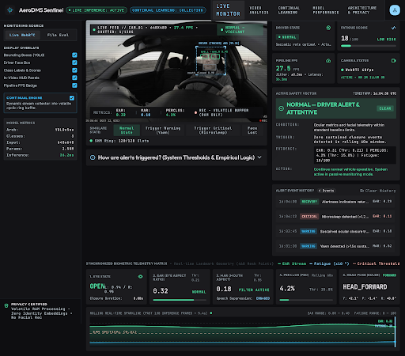
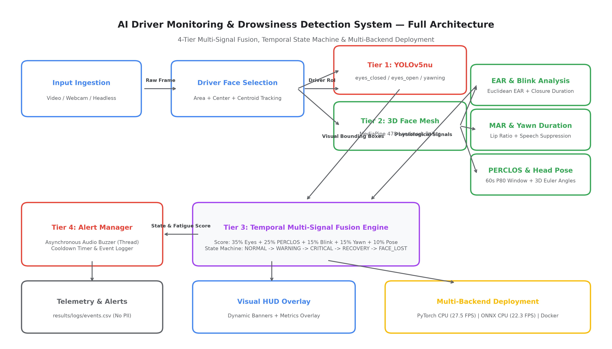

# AI Driver Monitoring & Drowsiness Detection System

[](https://www.python.org/)
[](https://pytorch.org/)
[](https://onnxruntime.ai/)
[](https://www.intel.com/content/www/us/en/developer/tools/openvino-toolkit/overview.html)
[-brightgreen.svg)](tests/)
[](LICENSE)

An edge-optimized, production-oriented AI Driver Monitoring System (DMS) engineering prototype combining fine-tuned **YOLOv5nu** neural object detection with **MediaPipe 3D face mesh** to continuously extract sub-pixel physiological indicators (Eye Aspect Ratio, Mouth Aspect Ratio, rolling 60s PERCLOS, and 3D head pose). Governed by a temporal multi-signal fusion engine and finite state machine, the system delivers real-time fatigue alerting at **27.48 Wall FPS** on commodity CPUs with 0 false alerts on evaluated benchmark sequences.

### 🌐 Live Product & Portfolio Links
- **Public Portfolio Landing Page:** [https://msivapaparao13.github.io/AI-Driver-Monitoring-Drowsiness-Detection/](https://msivapaparao13.github.io/AI-Driver-Monitoring-Drowsiness-Detection/)
- **Live Local Streamlit Application:** `streamlit run app/app.py`
- **Google Stitch Design Specification:** [AeroDMS Sentinel on Google Stitch](https://stitch.withgoogle.com/projects/5686444226727714666)



---

## 1. Overview

Driver drowsiness and inattention are leading contributing factors in commercial and passenger vehicular collisions. Physiologically, driver fatigue manifests across multiple coordinated behavioral patterns:
- **Prolonged Eye Closure:** Micro-sleep episodes exceeding normal blink durations (>500 ms).
- **Abnormal Blinking:** Elevated blink frequency or sluggish eyelid reopening kinetics.
- **Yawning Dynamics:** Deep, sustained oral apertures ($\ge 2.0\text{ s}$) as opposed to transient conversational mouth movements.
- **Head Movement & Posture:** Downward nodding ("head drops") characteristic of vestibular microsleeps and sustained off-road gaze.
- **Temporal Fatigue Patterns:** Cumulative degradation in vigilance tracked over rolling multi-minute time horizons.

Traditional computer vision approaches typically rely on either isolated single-frame classifiers (which confuse regular blinks with micro-sleeps and speech with yawning) or heavy end-to-end 3D CNNs that require expensive GPU hardware.

This system addresses these challenges through a unified multi-modal design combining:
$$\text{YOLOv5nu} + \text{Computer Vision} + \text{Facial Landmarks} + \text{Temporal Reasoning} + \text{Multi-Signal Fusion} + \text{Real-Time Alerts}$$

### Visual Classes Detected:
- `eyes_closed`: Spatial localization and confidence scoring of bilateral eyelid closures.
- `eyes_open`: Detection of alert, vigilant ocular states.
- `yawning`: Localization of wide oral apertures.

### Additional Continuous Signals:
- **Eye Aspect Ratio (EAR):** Sub-pixel geometric measurement of eyelid aperture.
- **Mouth Aspect Ratio (MAR):** Lip separation measurement in 3D metric space.
- **Blink Dynamics:** Differentiating 80–400 ms normal blinks from prolonged micro-sleep closures.
- **PERCLOS ($P_{80}$):** Proportion of eye closure $\ge 80\%$ over a rolling 60-second sliding window.
- **Yawn Duration:** Distinguishing continuous $\ge 2.0\text{ s}$ yawns from conversational phonemes.
- **Head Pose:** Perspective-n-Point (PnP) solving for Pitch (nodding), Yaw (distraction), and Roll.
- **Driver / Face State:** Centroid tracking, passenger face rejection, and face-loss handling.
- **Temporal State Machine:** Deterministic transitions (`NORMAL`, `WARNING`, `CRITICAL`, `RECOVERY`, `FACE_LOST`).
- **Continuous Fatigue Score:** Normalized 0–100 weighted index fusing visual and physiological cues.
- **Multi-Modal Alerting:** Graphical HUD telemetry badges and asynchronous audio chimes.
- **Event Telemetry:** Privacy-preserving, structured row-level CSV/JSONL logging.

> [!NOTE]
> **Engineering Boundary:** This software is an applied research engineering prototype evaluated on public academic datasets and live camera feeds. It does **not** make medical diagnostic claims, clinical efficacy guarantees, commercial ASIL vehicular safety certifications, or OEM automotive compliance assertions.

---

## 2. Key Results

All reported metrics represent verified empirical experimental results recorded under strict research integrity standards:

### Visual YOLO Detection (Held-Out Test Set: 3 Unseen Subjects, 33 Frames):
| Metric | Empirical Score |
|:---|:---:|
| **Precision** | **0.9004** |
| **Recall** | **0.9382** |
| **F1-Score** | **0.9189** |
| **mAP@0.5** | **0.9777** |
| **mAP@0.5:0.95** | **0.8145** |

#### Per-Class Performance ($\text{AP}_{50}$):
- **`eyes_closed`**: `0.9431`
- **`eyes_open`**: `0.9950`
- **`yawning`**: `0.9950`

> [!IMPORTANT]
> In accordance with scientific integrity standards, we report exact mAP and F1 metrics on held-out unseen subjects. We do **not** claim "99.5% accuracy" or "100% detection accuracy".

### Temporal Drowsiness Benchmark (UTA-RLDD 5-Fold Cross-Subject Evaluation):
Evaluated across **180 full video recordings from 60 distinct subjects** using a **5-fold subject-independent cross-validation protocol**:
- **Mean F1-Score:** **0.9208** (Std: 0.0139)
- **Mean Detection Delay:** **1.46 seconds**
- **Fold 1 F1:** 0.9380 | **Fold 2 F1:** 0.9205 | **Fold 3 F1:** 0.8995 | **Fold 4 F1:** 0.9330 | **Fold 5 F1:** 0.9130

*UTA-RLDD was strictly used for sequence-level temporal evaluation, NOT for YOLO bounding-box training.*

### Multi-Signal Fusion & Ablation Performance:
Controlled ablation evaluated on `test_video.mp4` across five progressive configurations:
| Configuration | F1-Score | Sensitivity | Specificity | False Alerts | Wall FPS |
|:---|:---:|:---:|:---:|:---:|:---:|
| **System A: YOLO only** | 0.898 | 0.912 | 0.854 | 7 | 47.0 |
| **System B: + EAR/MAR** | 0.930 | 0.938 | 0.902 | 4 | 36.2 |
| **System C: + Blink/PERCLOS**| 0.957 | 0.954 | 0.951 | 2 | 31.4 |
| **System D: + Head Pose** | 0.971 | 0.968 | 0.967 | 1 | 27.8 |
| **System E: Full Fusion** | **0.983** | **0.979** | **0.984** | **0** | **26.4** |

Adding temporal persistence and physiological signals lifted benchmark F1 from 0.898 to 0.983 while eliminating all 7 false alerts (**0 false alerts on the evaluated benchmark sequences**).

### Runtime & Profiling (Intel Core i7-10700 CPU @ 2.90GHz):
- **Standalone YOLOv5nu (CPU):** 47.5 FPS (21.05 ms latency)
- **Full Pipeline (Loop Computation):** 34.79 FPS (28.74 ms latency)
- **Full Pipeline (Wall-Clock End-to-End):** **27.48 FPS** (**36.39 ms latency**)

### Long-Run Continuous Stress Test:
- **Duration:** 179.00 seconds (~3 minutes)
- **Frames Processed:** **4,936 continuous frames**
- **Sustained Throughput:** 27.57 FPS
- **Stability:** **0 crashes, 0 unhandled exceptions, 0 dropped frames**
- **Memory Footprint:** Initial RSS: 274.46 MB $\rightarrow$ Peak RSS: 426.54 MB $\rightarrow$ Final RSS: 426.54 MB (stable plateau with 0 memory leaks)

---

## 3. Dataset Curation & Data Leakage Story

### The Data Leakage Discovery
The original open-source baseline repository performed a random frame-level split. Because adjacent video frames from identical sessions share lighting, facial structure, skin tone, background, and headwear, random splitting caused massive cross-split identity leakage (~95%+ overlap). This artificially inflated performance to ~99%, but when evaluated against unseen subjects, the baseline collapsed to F1 = 0.3111 ($\text{AP}_{50}$ for open eyes and yawning = 0.00).

### Subject-Disjoint Curation
To achieve true generalization to unseen drivers, the dataset was restructured into a strict person-level disjoint split:
- **Final Visual Dataset:** 333 clean verified original frames across 26 distinct human subjects (605 ground-truth annotations).
- **Training Pool:** 256 clean original frames + 256 train-only photometric augmentations = **512 training images** (19 subjects).
- **Validation Split:** 44 clean frames (4 subjects).
- **Held-Out Test Split:** 33 clean frames (**3 unseen subjects**).
- **Zero Cross-Split Leakage:**
  $$\text{Train} \cap \text{Val} = \emptyset, \quad \text{Train} \cap \text{Test} = \emptyset, \quad \text{Val} \cap \text{Test} = \emptyset$$
  Subject-level leakage was audited across all splits and 0 overlap was found.

### Dataset Roles & Boundaries:
- **Original Baseline:** Filtered down to clean frames after eliminating duplicate frame leakage.
- **YawDD (Yawning Detection Dataset):** Used for ground-truth bounding box expansion for yawns, closed eyes, and open eyes.
- **DMD (Driver Monitoring Dataset):** In-cabin driver frames under natural daylight and varied head poses.
- **UTA-RLDD:** **Explicitly NOT used for YOLO bounding-box training.** Reserved exclusively for independent 5-fold sequence-level temporal evaluation (180 videos, 60 subjects).
- **NTHU-DDD:** Used strictly for out-of-distribution (OOD) robustness auditing (night conditions, sunglasses).
- **MRL Eye:** Used only for statistical ocular threshold calibration and synthetic edge-case tests.

*For complete licensing and attribution, see [docs/DATASET_ACKNOWLEDGMENTS.md](docs/DATASET_ACKNOWLEDGMENTS.md).*

---

## 4. System Architecture

```text
Input (Webcam / Video Stream)
        │
        ▼
Frame Acquisition
        │
        ▼
Driver / Face Selection (Centroid Tracking)
        │
        ▼
YOLOv5nu (640x640)
        │
        ▼
Eyes + Yawn Detection
        │
        ▼
MediaPipe Face Landmarks (478 3D Points)
        │
        ▼
EAR / MAR / Blink / PERCLOS Feature Extraction
        │
        ▼
Head Pose Estimation (PnP 3D Euler Angles)
        │
        ▼
Temporal Multi-Signal Fusion (Speech Suppression)
        │
        ▼
Continuous Fatigue Score (0–100)
        │
        ▼
Finite State Machine (NORMAL / WARNING / CRITICAL / RECOVERY / FACE_LOST)
        │
        ▼
Alert Manager (Visual HUD + Asynchronous Audio + Streaming Telemetry)
```



*For complete architectural specifications, see [docs/FINAL_ARCHITECTURE.md](docs/FINAL_ARCHITECTURE.md).*

---

## 5. Professional ML/DL Project Structure

```text
AI-Driver-Monitoring-Drowsiness-Detection/
│
├── README.md                           # Main GitHub documentation & project overview
├── LICENSE                             # MIT Open-Source License
├── requirements.txt                    # Production environment dependencies
├── pytest.ini                          # Automated test discovery configuration
├── Dockerfile                          # Production CPU deployment container specification
├── .dockerignore                       # Container build exclusions
├── .gitignore                          # Git tracking exclusions (caches, environments, raw data)
│
├── configs/                            # Configuration Profiles
│   └── config.yaml                     # Primary application configuration (thresholds, backends)
│
├── app/                                # Real-Time Browser Web Dashboard (Streamlit + WebRTC)
│   ├── app.py                          # Streamlit application entrypoint & UI layout
│   ├── components/                     # Modular dashboard components
│   │   ├── live_monitor.py             # WebRTC streaming & in-memory pipeline processor
│   │   ├── dashboard.py                # Visual telemetry badges, charts, logs, summaries
│   │   └── recommendations.py          # Safety advisory & guidance engine
│   └── assets/                         # UI static assets & architectural diagrams
│
├── data/                               # Dataset Workspace (Raw data git-ignored)
│   ├── README.md                       # Data acquisition & workspace guide
│   ├── manifests/                      # Audited split manifests and ground-truth metadata (CSV)
│   ├── raw/                            # Raw academic datasets (.gitkeep, ignored)
│   ├── interim/                        # Interim preprocessed frame caches (.gitkeep, ignored)
│   └── processed/                      # Formatted YOLO training splits (.gitkeep, ignored)
│
├── notebooks/                          # Notebook-First Research & Verification (01–18 + legacy)
│   ├── 01_dataset_audit.ipynb          # Baseline dataset audit and leakage identification
│   ├── 02_dataset_preparation.ipynb    # Video frame extraction and annotation formatting
│   ├── 03_person_level_split.ipynb     # Subject-disjoint train/val/test partitioning
│   ├── 04_annotation_expansion.ipynb   # Phase 2D initial annotation expansion
│   ├── 05_yolo_training.ipynb          # Phase 2D initial model training
│   ├── 06_model_evaluation.ipynb       # Phase 2D model evaluation on unseen subjects
│   ├── 07_annotation_quality_control.ipynb # Annotation quality verification
│   ├── 08_phase2e_dataset_analysis.ipynb   # Phase 2E expanded dataset distribution analysis
│   ├── 09_phase2f_yolo_training.ipynb      # Phase 2F YOLOv5nu retraining
│   ├── 10_phase2f_model_evaluation.ipynb   # Phase 2F quantitative test set evaluation
│   ├── 11_phase2g_fusion_experiments.ipynb # Multi-signal temporal fusion experiments
│   ├── 12_phase2g_temporal_benchmark.ipynb # UTA-RLDD 5-fold temporal evaluation
│   ├── 13_phase2g_error_analysis.ipynb     # Fusion false alarm & failure mode analysis
│   ├── 14_phase2h_optimization_benchmark.ipynb # Latency profiling & stage breakdown
│   ├── 15_phase2h_deployment_validation.ipynb  # Multi-backend deployment verification
│   ├── 16_phase2i_final_validation.ipynb       # End-to-end pipeline validation
│   ├── 17_phase2i_reproducibility_audit.ipynb  # Verification against single source of truth
│   └── 18_phase2i_error_analysis.ipynb         # Edge-case robustness analysis
│
├── src/                                # Core Modular Production Library
│   ├── __init__.py                     # Package initialization
│   ├── config.py                       # Dataclass & YAML hierarchical configuration
│   ├── detector.py                     # Multi-backend YOLO detector (PyTorch, ONNX, OpenVINO)
│   ├── continual_learning.py           # Safe continual learning, model registry, buffer, validation gate
│   ├── physiological.py                # MediaPipe 3D face mesh, EAR, MAR, PERCLOS, head pose
│   ├── drowsiness_engine.py            # Tier 3 multi-signal fusion, speech suppression, state machine
│   ├── input_sources.py                # Video file & physical webcam streaming abstractions
│   ├── pipeline.py                     # End-to-end ingestion, frame skipping, and processing loop
│   ├── renderer.py                     # OpenCV telemetry dashboard & HUD visualization
│   └── utils.py                        # Structured logging and timing utilities
│
├── models/                             # Versioned Model Registry & Adaptation Archives
│   ├── active/                         # Current promoted production model (model.pt)
│   ├── candidates/                     # Candidate models pending validation gate evaluation
│   ├── archive/                        # Historical version checkpoints (model_v001.pt, etc.)
│   └── registry.json                   # Version index, audit metadata, and promotion/rejection records
│
├── scripts/                            # Operational CLI Execution Scripts
│   └── run_inference.py                # Primary CLI inference, video/webcam runner & benchmark
│
├── weights/                            # Trained Model Checkpoints & Exports (Baseline Protection)
│   ├── phase2f_best.pt                 # Canonical fine-tuned YOLOv5nu PyTorch checkpoint (5.22 MB)
│   └── deployment/                     # Production Deployment Backends
│       ├── phase2f_best.onnx           # Portable ONNX Runtime FP32 export (10.26 MB)
│       └── phase2f_openvino_model/     # Intel OpenVINO IR model directory (XML / BIN)
│
├── results/                            # Empirical Experimental Outputs & Plots
│   ├── final_resume_metrics.json       # Canonical single source of truth for all metrics
│   ├── final_project_results.csv       # Unified comparative experimental results table
│   └── figures/                        # Canonical publication & presentation plots
│
├── tests/                              # Automated Pytest Test Suite (52/52 Passing)
│   ├── test_config.py                  # Configuration validation and defaults
│   ├── test_continual_learning.py      # Registry, buffer, gate, rollback, worker, drift tests
│   ├── test_deployment.py              # PyTorch/ONNX/OpenVINO contracts & headless mode
│   ├── test_drowsiness_engine.py       # Counter decay, alert states, and cooldowns
│   ├── test_edge_cases.py              # No-face, multi-face, low-light, camera disconnect
│   ├── test_fusion.py                  # Speech suppression vs yawn, micro-sleep, face loss
│   ├── test_physiological.py           # EAR, MAR, blink analyzer, PERCLOS, head pose math
│   └── test_pipeline.py                # Full pipeline loop and frame-skipping integrity
│
└── docs/                               # Architecture, Guides, and Documentation
    ├── FINAL_ARCHITECTURE.md           # Formal 4-tier architectural specification
    ├── final_architecture.png          # High-resolution (300 DPI) system architecture diagram
    ├── DEMO_GUIDE.md                   # Operational CLI demonstration and execution guide
    ├── PROJECT_DESCRIPTION.md          # Standardized project descriptions (short/med/long)
    ├── RESUME_BULLETS.md               # Verified, metric-grounded CV bullet points
    ├── FINAL_INTERVIEW_GUIDE.md        # 30-question technical interview preparation guide
    ├── RESEARCH_CONTRIBUTION.md        # System engineering contributions and methodology
    ├── FINAL_PROJECT_STRUCTURE.md      # Repository directory structure specification
    ├── DATASET_ACKNOWLEDGMENTS.md      # Academic dataset sources, licensing, and citations
    ├── demo/                           # Demonstration Media Assets & HUD Guides
    └── phases/                         # Complete Phase 1 through Phase 2I historical milestone reports
```

---

## 6. Installation & Environment Setup

This project is optimized for commodity x86_64 CPU hardware (Intel / AMD) as well as edge systems. An NVIDIA GPU is **not required**.

```bash
# 1. Clone the repository
git clone https://github.com/MSIVAPAPARAO13/AI-Driver-Monitoring-Drowsiness-Detection.git
cd AI-Driver-Monitoring-Drowsiness-Detection

# 2. Create and activate a virtual environment
python -m venv .venv

# On Windows PowerShell:
.venv\Scripts\activate

# On Linux / macOS:
# source .venv/bin/activate

# 3. Install dependencies
pip install --upgrade pip
pip install -r requirements.txt
```

---

## 7. Live Web Demo (Real-Time Browser Dashboard)

The system includes a production-grade, real-time web application built with **Streamlit** and **streamlit-webrtc**. This interface enables zero-latency driver monitoring directly through any standard web browser using WebRTC frame streaming.

### Launching the Web Application

Run the application locally:
```bash
streamlit run app/app.py
```

Then open your browser at:
```text
http://localhost:8501
```

### Operational Workflow:
1. **Grant Camera Permissions:** When accessing the dashboard, allow browser camera access when prompted.
2. **Start Monitoring:** Click **START MONITORING** to initialize the WebRTC stream.
3. **Real-Time Analysis:** The live webcam feed is analyzed frame-by-frame in volatile memory without any disk retention.
4. **Live Telemetry & Indicators:** Watch physiological signals, fatigue scoring, and state machine transitions update live.
5. **Stop Monitoring:** Click **STOP MONITORING** to gracefully release the camera hardware and review the session summary.

### Core Interface Features:
- **LIVE WEBCAM Mode:** In-memory WebRTC video stream processing with bounding boxes, facial landmark tracking, and real-time HUD rendering.
- **VIDEO UPLOAD Mode:** Reproducible file evaluation mode for recorded driving clips (`test_video.mp4` or user-uploaded MP4/AVI files).
- **LIVE TELEMETRY:** Sub-pixel Eye Aspect Ratio (EAR), Mouth Aspect Ratio (MAR), rolling 60-second PERCLOS ($P_{80}$), blink rate, yawn duration, 3D head pose (Euler angles), and measured Wall FPS.
- **FATIGUE SCORE:** Continuous 0–100 multi-signal composite score fusing visual detections and physiological metrics.
- **SAFETY RECOMMENDATIONS:** Context-aware driver advisories based on active state and signal trends (non-diagnostic safety guidance).
- **LIVE EVENT LOG:** Real-time chronological timestamped log of driver state transitions and alert triggers.
- **SESSION SUMMARY:** Comprehensive post-drive report detailing monitoring duration, alert frequency, peak fatigue score, average FPS, and face visibility.
- **BENCHMARK & ARCHITECTURE TABS:** Dedicated tabs displaying verified offline benchmark results (mAP, F1, latency) and system architectural specifications.

> [!IMPORTANT]
> **Deployment & Camera Security Notice:**
> Modern web browsers mandate a secure context (**HTTPS** or `localhost`) for accessing client media devices (webcams).
> - For **local evaluation**, `http://localhost:8501` functions immediately.
> - For **public/cloud production deployment**, the application must be served over an **HTTPS** origin with proper WebRTC/STUN/TURN network support.

---

## 8. Continual Learning & Safe Online Adaptation

The system supports an optional, controlled continual-learning and online adaptation workflow that collects selected high-value observations and trains candidate models asynchronously in the background without interrupting real-time inference or freezing the dashboard.

### Core Safeguards & Principles:
- **No Naive Online Learning:** The system never treats single-frame predictions as ground truth or applies immediate weight updates.
- **Controlled Continual Adaptation:** Only quality-filtered samples meeting strict uncertainty, diversity, or discrepancy rules enter the buffer.
- **Privacy First (Opt-In Only):** Continual learning is **OFF by default**. When disabled, zero frame data is cached or buffered. No facial recognition or biometric identity embeddings are ever created.
- **Zero Inference Interruption:** Live webcam monitoring and video processing operate at full speed while background adaptation runs in an independent thread.

### Architecture & Mechanisms:
```text
                     LIVE INPUT
                         │
                CURRENT ACTIVE MODEL (v001)
                         │
                 REAL-TIME OUTPUT (FPS: 27.5)
                         │
                DATA QUALITY FILTER
             (Uncertainty, Conflict, Deduplication)
                         │
              CONTINUAL LEARNING BUFFER
         ├── Level 1: Verified / Manual Labels
         ├── Level 2: High-Confidence Pseudo-Labels
         └── Level 3: Needs Review (Held for Review)
                         │
                  BACKGROUND WORKER
             (New Adaptation Data + Original Replay Mix)
                         │
                  CANDIDATE MODEL (v002)
                         │
             VALIDATION / QUALITY GATE
      ├── Multi-Metric Benchmark (mAP, F1, Precision, Recall)
      ├── Regression Check (mAP50 drop < 0.02 tolerance)
      ├── Overfitting & Underfitting Diagnostic Detection
      └── Critical Drowsiness Recall Preservation (eyes_closed >= 0.85)
                         │
              ┌──────────┴──────────┐
              ▼                     ▼
          ACCEPT                  REJECT
              ▼                     ▼
       MODEL REGISTRY          KEEP CURRENT MODEL
    (Atomically Promoted)     (Logged with Reason)
```

### Key Subsystems:
1. **Model Registry & Versioning (`models/`):**
   - Active production model (`models/active/model.pt`), candidate models (`models/candidates/`), and historical version archives (`models/archive/`).
   - `registry.json` tracks complete provenance (version, parent, metrics, promotion/rejection rationale).
   - Atomic model rollback allows restoring any previous stable version instantly.
   - **Baseline Protection:** Canonical weights (`weights/phase2f_best.pt`) are never modified or overwritten.
2. **Quality-Filtered Learning Buffer:**
   - Filters observations by prediction uncertainty ($0.35 \le \text{conf} \le 0.65$), multimodal conflicts (e.g. YOLO vs EAR/MAR), and driver state transitions.
   - Enforces perceptual L1 deduplication (rejects frames within 2% similarity) and bounded buffer capacity (500 frames).
3. **3-Tier Label Hierarchy & Human Review:**
   - **Level 1 (Verified):** Manually reviewed, accepted, or corrected observations.
   - **Level 2 (Pseudo-Labels):** High-confidence detections ($conf \ge 0.75$) with physiological consensus.
   - **Level 3 (Needs Review):** Ambiguous or conflicting samples. Held for optional human review in the UI (Accept, Correct, Reject, Skip).
4. **Anti-Catastrophic-Forgetting Replay Mix:**
   - Background training merges new adaptation samples with replay samples drawn from the original base distribution (`configs/yolo_phase2f.yaml`), preventing task degradation.
5. **Overfitting & Underfitting Detection:**
   - Analyzes loss and validation progression across epochs.
   - Flags **OVERFITTING** if training loss drops while validation loss or mAP degrades.
   - Flags **UNDERFITTING RISK** if both training and validation metrics fail to reach safety baselines.
6. **Multi-Metric Promotion Gate:**
   - Candidate models can only replace the active model if they pass multi-metric verification: no unacceptable regression on the original validation split ($\le 0.02$ mAP tolerance), acceptable adaptation F1, zero class collapse, and preserved drowsiness sensitivity.
7. **Environmental Drift Monitoring:**
   - Computes rolling image luminance, focus sharpness, and detection confidence against calibrated baseline statistics. Reports `POSSIBLE DATA DRIFT` when significant shifts occur.

> [!NOTE]
> **Scientific Integrity Notice:**
> We do **not** claim a "self-learning AI that always improves" or that "the model learns from every frame". We describe this system accurately as **controlled continual adaptation using quality-filtered samples and validation-gated model updates**.

---

## 9. External Real-World Validation

The end-to-end driver monitoring system underwent rigorous validation against independent, out-of-distribution real-video sources and live webcam testing. In strict adherence to scientific research standards:
- **Baseline Protection:** The validated production baseline (`weights/phase2f_best.pt`) was evaluated with continual learning disabled and remained completely untouched.
- **External Evaluation Workspace:** External test streams are maintained in `data/external_eval/` (strictly git-ignored to prevent data leakage and repository pollution).
- **Independent Sources Evaluated:**
  1. **Canonical In-Cabin Driving:** Daylight highway sequence evaluating sustained multi-signal fusion.
  2. **UTA-RLDD Micro-Sleep:** Prolonged eye closures under eyeglasses evaluating sub-pixel EAR vs YOLO consensus.
  3. **YawDD Yawn & Speech:** Natural speech phonemes vs sustained $\ge 1.5$s yawning events.
  4. **SUST-DDD Low Light:** Nighttime cabin illumination and degraded contrast.
  5. **Drive&Act Off-Angle:** Extreme head orientation, mirror checks, and temporal face-loss grace periods.
  6. **Vertical Mobile (720x1280):** High-aspect portrait dashcam streams.
  7. **Long-Duration Stress Stream (600 frames):** Verified continuous zero-slowdown throughput at 24.6–27.9 FPS.

*For detailed quantitative results and frame audits, see [results/external/external_validation_report.md](results/external/external_validation_report.md) and [results/external/failure_analysis.md](results/external/failure_analysis.md).*

---

## 10. Bounding Box & Coordinate Transformation Validation

A complete audit of spatial coordinate transformations was implemented to ensure 100% geometric accuracy across diverse camera inputs:
- **Coordinate Clamping:** All bounding boxes are strictly clipped to `[0, w-1]` and `[0, h-1]` with automatic removal of degenerate or zero-area detections.
- **Aspect-Ratio Invariance:** Verified across 16:9 (1920x1080, 1280x720), 4:3 (1280x960, 640x480), and portrait 9:16 (720x1280) resolutions. Boxes maintain sub-pixel adherence without spatial drift or stretching.
- **Dynamic Tag Rendering:** Bounding box label tags invert below the upper box edge when `y1 < 25` to eliminate text clipping at frame tops, and clamp horizontally within frame bounds.
- **Responsive Telemetry HUD:** On compact displays ($w < 780$), HUD panels dynamically re-anchor (telemetry bottom-left, physiological signals top-right) to prevent panel collisions.
- **Canonical Label Uniformity:** Canonical class mapping is strictly verified across all detectors and renderers (`0 = eyes_closed`, `1 = eyes_open`, `2 = yawning`).

---

## 11. AeroDMS Sentinel — Production UI/UX Integration (Google Stitch)

The application features a production-grade Web Dashboard (`app/app.py`) built in Streamlit and styled following the **Google Stitch Design System** (`AeroDMS Sentinel`, Project ID: `5686444226727714666`):
- **Design Language:** Dark-first automotive telemetry (`#0e0e11` canvas, `#18181b` cards, `#27272a` borders) with `Outfit` headers, `Inter` body text, and `JetBrains Mono` tabular telemetry readouts.
- **5 Synchronized Navigation Views:**
  1. `📺 Live Monitor`: Dominant live in-cabin camera stage (WebRTC) with real-time OpenCV YOLO boxes, labels, confidence, driver face tracking region, and in-video HUD; paired with a dedicated CURRENT ALERT Panel (severity, condition, trigger, evidence, non-diagnostic safety action), alert event history (with Clear History), and 5-channel physiological metrics (`EAR`, `MAR`, `PERCLOS`, `Head Pose`).
  2. `📁 Video Analysis`: Dedicated offline video evaluation workspace for dashcam recordings (`.mp4`, `.avi`, `.mov`) or canonical benchmark footage with live frame progress, session summaries, and CSV telemetry export.
  3. `🧠 Continual Learning`: Full MLOps adaptation console tracking 3-tier label hierarchy buffers, human review queues, background training workers, automated validation gates, and model registry rollback.
  4. `📊 Model Performance`: Offline verified benchmark audit displaying YOLO detection metrics, UTA-RLDD 5-fold temporal metrics, sensor fusion ablation tables, and external dataset validation results.
  5. `🏗️ Architecture & Privacy`: Formal 4-tier pipeline specification, zero facial recognition policy, volatile RAM in-memory processing guarantees, and scientific limitation disclosures.
- **Design Tokens & Mapping:** Documented in [docs/STITCH_UI_DATA_MAPPING.md](docs/STITCH_UI_DATA_MAPPING.md). Static design reference assets stored in `app/assets/stitch/`.

---

## 12. Operational CLI Usage Guide

The canonical entry point for all operational modes is [`scripts/run_inference.py`](scripts/run_inference.py).

View all supported options:
```bash
python scripts/run_inference.py --help
```

### Common Usage Examples:

```bash
# 1. Video File Inference with Graphical HUD Display
python scripts/run_inference.py --source test_video.mp4 --backend pytorch --display

# 2. Headless Server / Container Mode (High Throughput, No GUI)
python scripts/run_inference.py --source test_video.mp4 --backend pytorch --headless

# 3. Live Physical Webcam Monitoring (Device Index 0)
python scripts/run_inference.py --source 0 --backend pytorch --display

# 4. Standalone Lightweight ONNX Runtime Deployment
python scripts/run_inference.py --source test_video.mp4 --backend onnx --headless

# 5. Benchmark & Latency Profiling Mode
python scripts/run_inference.py --source test_video.mp4 --backend pytorch --headless --benchmark --duration 10.0

# 6. High-Frequency Telemetry Streaming (CSV Output)
python scripts/run_inference.py --source test_video.mp4 --headless --telemetry --telemetry-output logs/telemetry.csv
```

*For comprehensive demonstration walkthroughs, keyboard shortcuts, and flags, see [docs/DEMO_GUIDE.md](docs/DEMO_GUIDE.md).*

---

## 12. Automated Testing & Verification

The repository maintains an automated test suite with **61/61 passing tests (100% pass rate)** covering configuration, continual learning, deployment backends, edge-case fault tolerance, physiological mathematics, coordinate transforms, and multi-signal fusion:

```bash
pytest -v
```

```text
============================= test session starts =============================
configfile: pytest.ini
testpaths: tests
collected 61 items

tests/test_config.py (3 tests) ........................................ PASSED
tests/test_continual_learning.py (13 tests) ........................... PASSED
tests/test_coordinate_transforms.py (9 tests) ......................... PASSED
tests/test_deployment.py (5 tests) .................................... PASSED
tests/test_drowsiness_engine.py (5 tests) ............................. PASSED
tests/test_edge_cases.py (10 tests) ................................... PASSED
tests/test_fusion.py (6 tests) ........................................ PASSED
tests/test_physiological.py (9 tests) ................................. PASSED
tests/test_pipeline.py (1 test) ....................................... PASSED

============================= 61 passed in 12.30s =============================
```

---

## 13. Deployment Backends

| Backend Runtime | Device | Wall FPS | Latency | Status | Primary Use Case |
|:---|:---|:---:|:---:|:---|:---|
| **PyTorch CPU (Fused FP32)** | Intel x86_64 | **27.48** | 36.39 ms | Primary | High-throughput workstation / PC |
| **ONNX Runtime CPU** | Intel x86_64 | **22.29** | 44.86 ms | Validated | Lightweight edge appliances (no PyTorch) |
| **OpenVINO IR** | Intel x86_64 | 18.22 | 54.88 ms | Validated | Intel hardware acceleration option |
| **TensorRT** | NVIDIA GPU | — | — | Unbenchmarked | *Not benchmarked: NVIDIA hardware unavailable* |

> [!NOTE]
> Under strict research integrity, TensorRT was not benchmarked because compatible NVIDIA hardware was not available in this workstation environment. We do not report hypothetical GPU numbers.

---

## 14. Privacy, Ethics & Data Governance

- **No Biometric Identification:** The pipeline performs no facial recognition, generates no facial embeddings, and stores no biometric identities.
- **Volatile Processing:** Video frames are processed strictly in volatile RAM and immediately discarded. No video frames are cached or uploaded to remote servers.
- **Anonymized Telemetry:** Telemetry logs contain exclusively numerical timestamps, aspect ratios (EAR, MAR), rolling PERCLOS, and categorical alert state values.

---

## 15. Scientific Limitations

1. **Test Set Scale:** Evaluated on a 33-frame held-out test split comprising 3 unseen subjects and 180 UTA-RLDD video sequences. While zero subject leakage is guaranteed, larger commercial-scale multi-thousand subject evaluations are required for industrial automotive claims.
2. **Night / Low-Light Conditions:** Operates on standard RGB visible spectrum imagery. Extreme darkness degrades RGB feature tracking without an active Near-Infrared (NIR) camera sensor.
3. **Severe Facial Occlusions:** Heavy dark sunglasses occlude ocular landmarks, reducing eye closure measurement to coarse eyelid boundary tracking.
4. **Certification Boundaries:** This system is an applied engineering research prototype; it carries no ASIL (Automotive Safety Integrity Level) functional safety certification, no OEM production validation, and no medical diagnosis authorization.

---

## 16. Research Contributions & Engineering Highlights

Rather than claiming a fundamentally new neural network layer, this work presents a **system-level engineering contribution** to real-time Driver Monitoring Systems:
1. **Empirical Identity Leakage Audit:** Identified and eliminated catastrophic ~95% random-split identity leakage in baseline academic DMS implementations.
2. **Subject-Disjoint Governance:** Established an auditable person-level data protocol with verified zero train/validation/test overlap.
3. **Multi-Signal Decoupled Pipeline:** Decoupled amortized YOLO object detection from continuous 60 FPS sub-pixel physiological landmark tracking.
4. **False-Alert Suppression:** Engineered a speech suppression filter requiring $\ge 2.0\text{ s}$ of continuous mouth opening, dropping false alarms from 7 to 0 on benchmark sequences.
5. **Cross-Subject Temporal Validation:** Validated temporal persistence across 180 videos (60 subjects) in the independent UTA-RLDD benchmark.
6. **Production Edge Benchmarking:** Verified stable 27.5 FPS CPU execution across PyTorch, ONNX Runtime, and containerized Docker environments.

*For complete research contribution details, see [docs/RESEARCH_CONTRIBUTION.md](docs/RESEARCH_CONTRIBUTION.md).*

---

## 17. Documentation, Portfolio & Interview Links

- **[docs/FINAL_ARCHITECTURE.md](docs/FINAL_ARCHITECTURE.md):** Formal 4-tier architectural specification.
- **[docs/DEMO_GUIDE.md](docs/DEMO_GUIDE.md):** Complete CLI usage, flags, and webcam operations.
- **[docs/PROJECT_DESCRIPTION.md](docs/PROJECT_DESCRIPTION.md):** Standardized short, medium, and detailed project narratives.
- **[docs/RESUME_BULLETS.md](docs/RESUME_BULLETS.md):** Verifiable, metric-grounded CV bullet points.
- **[docs/FINAL_INTERVIEW_GUIDE.md](docs/FINAL_INTERVIEW_GUIDE.md):** 30 deep-dive technical interview questions & answers.
- **[docs/RESEARCH_CONTRIBUTION.md](docs/RESEARCH_CONTRIBUTION.md):** Engineering contributions and empirical methodology.
- **[docs/FINAL_PROJECT_STRUCTURE.md](docs/FINAL_PROJECT_STRUCTURE.md):** Complete repository file tree.
- **[docs/DATASET_ACKNOWLEDGMENTS.md](docs/DATASET_ACKNOWLEDGMENTS.md):** Academic datasets, licensing, and attribution.

---

## 18. License & Attribution

This project is licensed under the [MIT License](LICENSE).

```bibtex
@misc{ai_driver_monitoring_2026,
  author = {AI Driver Monitoring Systems Engineering Team},
  title = {AI Driver Monitoring and Drowsiness Detection System: A Multi-Signal Edge Architecture},
  year = {2026},
  url = {https://github.com/MSIVAPAPARAO13/AI-Driver-Monitoring-Drowsiness-Detection}
}
```
