# Phase 1 — Repository Audit

**Project:** Driver Drowsiness Detection System  
**Original Repository:** [AnanyaGodse/Drowsiness-Detection-using-YOLOv5](https://github.com/AnanyaGodse/Drowsiness-Detection-using-YOLOv5)  
**Audit Date:** October 3, 2026  
**Auditor:** Antigravity AI Assistant  
**Status:** Phase 1 Complete (Baseline Verified & Audited)

---

## 1. Project Overview

The audited repository provides a prototype driver drowsiness detection system that uses a YOLOv5 nano model (`yolov5nu.pt` under Ultralytics YOLOv8 architecture) to detect three facial states:
1. `eyes_closed`
2. `eyes_open`
3. `yawning`

Detections are passed into a frame-based state machine (`DrowsinessDetector`) that tracks consecutive frames of eye closure and yawning to trigger `WARNING` or `CRITICAL` alert banners overlaid onto video frames.

### Original Scope & Target
The original project was developed and executed within Kaggle notebook environments with GPU acceleration (Nvidia Tesla T4). It is primarily an exploratory proof-of-concept with training, augmentation, and inference stored as standalone Jupyter notebooks rather than a production-ready package or service.

Our overall mission across subsequent phases is to upgrade this prototype into an industry-grade, resume-level AI Driver Monitoring System (DMS). In **Phase 1**, our sole objective is an exhaustive, non-destructive audit and baseline verification.

---

## 2. Repository Structure

### 2.1 Complete Verified File Tree

```
c:\Users\msiva\Music\Drowsiness-Detection-using-YOLOv5\
├── .git/                                    # Git version control metadata
├── results/                                 # Training evaluation artifacts from Kaggle
│   ├── BoxF1_curve.png                      # F1-confidence curve (137,921 bytes)
│   ├── BoxPR_curve.png                      # Precision-Recall curve (98,028 bytes)
│   ├── BoxP_curve.png                       # Precision-confidence curve (119,505 bytes)
│   ├── BoxR_curve.png                       # Recall-confidence curve (127,574 bytes)
│   ├── confusion_matrix.png                 # Raw confusion matrix (123,740 bytes)
│   ├── confusion_matrix_normalized.png      # Normalized confusion matrix (135,760 bytes)
│   ├── labels.jpg                           # Dataset label distribution & bbox visuals (151,210 bytes)
│   ├── results.csv                          # 100-epoch training loss & metric log (12,190 bytes, 102 lines)
│   ├── results.png                          # Ultralytics multi-metric epoch curves (277,091 bytes)
│   ├── training_curves.png                  # Matplotlib 6-panel summary curve (614,296 bytes)
│   └── training_report.json                 # JSON summary of final validation metrics (487 bytes, 21 lines)
├── venv/                                    # Local Python 3.13 virtual environment (untracked)
├── best.pt                                  # Fine-tuned PyTorch YOLO model weights (5,253,499 bytes)
├── classes.txt                              # Class definition file (31 bytes, 3 lines)
├── custom_dataset.yaml                      # YOLO dataset configuration for Kaggle (312 bytes, 9 lines)
├── drowsiness-detection-data-augmentation.ipynb # Offline dataset augmentation notebook (1,324,023 bytes)
├── drowsiness-detection-inference.ipynb      # Video inference & alert visualization notebook (20,164 bytes)
├── drowsiness-detection-training.ipynb       # YOLO fine-tuning & evaluation notebook (87,638 bytes)
├── extract_frames.py                        # Utility script for video frame extraction (1,812 bytes, 45 lines)
├── output_video.mp4                         # Sample rendered inference video (11,382,439 bytes)
├── README.md                                # Project documentation (3,766 bytes, 131 lines)
├── splitting_data.ipynb                     # Train/val 80:20 data splitting notebook (3,765 bytes, 120 lines)
├── test_video.mp4                           # Raw sample test video clip (21,278,127 bytes)
└── xml_to_yolo.py                           # Pascal VOC XML to YOLO format converter (1,948 bytes, 52 lines)
```

### 2.2 Repository Content Inventory

| Category | Files Present | Notes |
| :--- | :--- | :--- |
| **Python Files** | [extract_frames.py](file:///c:/Users/msiva/Music/Drowsiness-Detection-using-YOLOv5/extract_frames.py), [xml_to_yolo.py](file:///c:/Users/msiva/Music/Drowsiness-Detection-using-YOLOv5/xml_to_yolo.py) | Standalone preprocessing utilities; no runtime inference script |
| **Notebooks** | [drowsiness-detection-training.ipynb](file:///c:/Users/msiva/Music/Drowsiness-Detection-using-YOLOv5/drowsiness-detection-training.ipynb), [drowsiness-detection-inference.ipynb](file:///c:/Users/msiva/Music/Drowsiness-Detection-using-YOLOv5/drowsiness-detection-inference.ipynb), [drowsiness-detection-data-augmentation.ipynb](file:///c:/Users/msiva/Music/Drowsiness-Detection-using-YOLOv5/drowsiness-detection-data-augmentation.ipynb), [splitting_data.ipynb](file:///c:/Users/msiva/Music/Drowsiness-Detection-using-YOLOv5/splitting_data.ipynb) | Contain the core business logic, training code, and inference pipeline |
| **Configs & YAML** | [custom_dataset.yaml](file:///c:/Users/msiva/Music/Drowsiness-Detection-using-YOLOv5/custom_dataset.yaml), [classes.txt](file:///c:/Users/msiva/Music/Drowsiness-Detection-using-YOLOv5/classes.txt) | Contains hardcoded Kaggle paths and class order discrepancies |
| **Model Weights** | [best.pt](file:///c:/Users/msiva/Music/Drowsiness-Detection-using-YOLOv5/best.pt) | 5.25 MB YOLOv5nu weights trained on Kaggle |
| **Video Assets** | [test_video.mp4](file:///c:/Users/msiva/Music/Drowsiness-Detection-using-YOLOv5/test_video.mp4), [output_video.mp4](file:///c:/Users/msiva/Music/Drowsiness-Detection-using-YOLOv5/output_video.mp4) | Both 1280x720 @ ~30.15 FPS, 617 frames, 20.47 seconds |
| **Evaluation Artifacts** | [results/](file:///c:/Users/msiva/Music/Drowsiness-Detection-using-YOLOv5/results) (11 files) | PR curves, F1 curve, confusion matrices, loss curves, JSON metrics |
| **Dependencies / Env** | None in Git repository | No `requirements.txt`, no `pyproject.toml`, no `.gitignore` |

---

## 3. Dataset Audit

### 3.1 Dataset Availability & Storage
- **Local Workspace:** Neither the raw video recordings (`data/videos`), extracted frames (`data/frames`), nor the augmented dataset (`augmented_dataset/`) are present in the Git repository.
- **External Hosting:** As referenced in [README.md](file:///c:/Users/msiva/Music/Drowsiness-Detection-using-YOLOv5/README.md#L130), data was collected and stored on Google Drive (`https://drive.google.com/drive/folders/1fFgNm9EoWftPsxFcINbP1lcAV0IGXwFt?usp=drive_link`) and uploaded to Kaggle as a private/custom input dataset (`/kaggle/input/drowsiness-detection-augmented-data/augmented_dataset`).

### 3.2 Dataset Structure & Class Schema
- **Annotation Format:** Standard YOLO normalized coordinates:
  `<class_id> <x_center> <y_center> <width> <height>` (values in range $[0.0, 1.0]$).
- **Number of Classes:** 3 classes.
- **Critical Schema Discrepancy Found:**
  - In [custom_dataset.yaml](file:///c:/Users/msiva/Music/Drowsiness-Detection-using-YOLOv5/custom_dataset.yaml) and [best.pt](file:///c:/Users/msiva/Music/Drowsiness-Detection-using-YOLOv5/best.pt):
    - `0: eyes_closed`
    - `1: eyes_open`
    - `2: yawning`
  - In [classes.txt](file:///c:/Users/msiva/Music/Drowsiness-Detection-using-YOLOv5/classes.txt):
    - Line 1: `eyes_open` (Index 0)
    - Line 2: `eyes_closed` (Index 1)
    - Line 3: `yawning` (Index 2)
  - In [xml_to_yolo.py](file:///c:/Users/msiva/Music/Drowsiness-Detection-using-YOLOv5/xml_to_yolo.py#L27):
    `class_id = classes.index(class_name)` directly reads `classes.txt`. If executed with `classes.txt`, `eyes_open` is assigned index 0, whereas `custom_dataset.yaml` and the trained model assign index 0 to `eyes_closed`.

### 3.3 Image Counts & Data Splits

| Split | Images | Bounding Box Instances | Instances Breakdown | Notes |
| :--- | :--- | :--- | :--- | :--- |
| **Original Training** | 169 | ~169 | Custom collected frames | From custom recorded videos |
| **Augmented Training** | 845 | ~845 | 169 originals + $4 \times 169$ augmented | Generated via Albumentations |
| **Validation** | 38 | 38 | 13 `eyes_closed`, 14 `eyes_open`, 11 `yawning` | Exactly 1 object per image |
| **Test Set** | 0 | 0 | None (no labeled test images) | Evaluated qualitatively via [test_video.mp4](file:///c:/Users/msiva/Music/Drowsiness-Detection-using-YOLOv5/test_video.mp4) |
| **Total Labeled Data** | 883 (augmented) | 883 | 207 unique frames collected | Small-scale dataset |

### 3.4 Data Augmentation Pipeline
Implemented in [drowsiness-detection-data-augmentation.ipynb](file:///c:/Users/msiva/Music/Drowsiness-Detection-using-YOLOv5/drowsiness-detection-data-augmentation.ipynb#L66-L111) using Albumentations:
- **Lighting variations ($p=0.8$):** `RandomBrightnessContrast(0.3, 0.3)`, `RandomGamma(70, 130)`, `CLAHE(clip_limit=4.0)`.
- **Color variations ($p=0.7$):** `HueSaturationValue(15, 30, 20)`.
- **Blur ($p=0.3$):** `MotionBlur(5)`, `GaussianBlur(3, 5)`, `MedianBlur(5)`.
- **Noise ($p=0.3$):** `GaussNoise`, `ISONoise`.
- **Geometric ($p=0.7$):** `Affine(scale=(0.8, 1.2), translate_percent=(0.0, 0.1), rotate=(-15, 15), shear=(-5, 5))`.
- **Flipping:** `HorizontalFlip(p=0.5)`.
- **Shadows:** `RandomShadow(p=0.3)`.
- **Applied Only To:** Training split (validation split was copied unaugmented).

---

## 4. Model Audit

### 4.1 Architecture Details
- **Architecture Family:** YOLOv5 updated / anchor-free P5 architecture (`yolov5nu.pt`), running on the **Ultralytics YOLOv8 engine** (`ultralytics.nn.tasks.DetectionModel`).
- **Layers & Parameters:**
  - Training Summary: 153 layers, 2,509,049 parameters, 7.2 GFLOPs.
  - Fused Inference Summary: 84 layers, 2,503,529 parameters, 7.1 GFLOPs.
- **Backbone & Neck:** Conv + C3 (CSP Bottleneck with 3 convolutions) + SPPF (Spatial Pyramid Pooling - Fast).
- **Head:** Anchor-free decoupled detection head with Distribution Focal Loss (`ultralytics.nn.modules.head.Detect`).
- **Input Dimensions:** $640 \times 640$ pixels (`imgsz=640`).

### 4.2 Training Hyperparameters (from `best.pt` metadata & `training.ipynb`)
- **Base Pretrained Weights:** `yolov5nu.pt` (downloaded from Ultralytics v8.3.0 release assets).
- **Epochs:** 100
- **Batch Size:** 16
- **Optimizer:** `AdamW` (`lr0=0.001`, `lrf=0.01`, `momentum=0.937`, `weight_decay=0.0005`).
- **Warmup:** 3.0 warmup epochs, `warmup_momentum=0.8`, `warmup_bias_lr=0.1`.
- **Regularization:** `dropout=0.1`, `patience=20` (early stopping did not trigger, full 100 epochs completed).
- **Runtime Environment:** Kaggle Tesla T4 GPU (15,095 MiB), CUDA 12.4, PyTorch 2.6.0+cu124, Ultralytics 8.3.232. Total training wall-time: 968.35 seconds (~16.1 minutes).

### 4.3 Inference Settings
- **Confidence Threshold (`conf`):** 0.40
- **IoU NMS Threshold (`iou`):** 0.50
- **Maximum Detections (`max_det`):** 3 (one driver expected in view)
- **Model Fusion:** `model.fuse()` called prior to inference loop to fuse Conv2d + BatchNorm2d layers.

---

## 5. Training Pipeline

```mermaid
flowchart TD
    A["Raw Driver Videos (data/videos/*.mp4)"] -->|extract_frames.py (frame_rate=20)| B["Extracted Class Frames (data/frames/)"]
    B -->|Manual Annotation| C["Pascal VOC XML Files"]
    C -->|xml_to_yolo.py + classes.txt| D["YOLO Format TXT Labels"]
    D -->|splitting_data.ipynb (80/20)| E["final_dataset/ (train & val)"]
    E -->|data-augmentation.ipynb (4x Albumentations)| F["augmented_dataset/ (845 train, 38 val)"]
    F -->|custom_dataset.yaml| G["YOLOv5nu Fine-Tuning (training.ipynb, 100 epochs, AdamW)"]
    G --> H["Saved Weights: best.pt (runs/drowsiness/yolov5_final/)"]
    H --> I["Validation Evaluation & training_report.json"]
```

### Reproduction Commands
Because the dataset is not in the local workspace, running training locally requires downloading the dataset from Google Drive or Kaggle, adjusting paths, and running:
```bash
python -c "from ultralytics import YOLO; model = YOLO('yolov5nu.pt'); model.train(data='custom_dataset.yaml', epochs=100, imgsz=640, batch=16, optimizer='AdamW', lr0=0.001)"
```

---

## 6. Inference Pipeline

### 6.1 Step-by-Step Execution Flow
1. **Video Ingestion:** `cv2.VideoCapture('test_video.mp4')` opens input video.
2. **Metadata Extraction:** Frame rate, width, height, and frame count are read from properties.
3. **Model Initialization:** `model = YOLO('best.pt'); model.fuse()`.
4. **State Tracker Initialization:** `detector = DrowsinessDetector(fps=fps)`.
5. **Frame Iteration & Skipping:**
   - On frame $k$: if `k % skip_frames == 0` (default `skip_frames=2`), runs YOLO prediction:
     `results = model.predict(frame, conf=0.4, iou=0.5, max_det=3, verbose=False)[0]`
   - Otherwise, reuses `last_results` from the previous frame.
6. **Class Detection Flags:**
   - `eyes_closed = any(int(box.cls[0]) == 0 for box in results.boxes)`
   - `eyes_open = any(int(box.cls[0]) == 1 for box in results.boxes)`
   - `yawning = any(int(box.cls[0]) == 2 for box in results.boxes)`
7. **State Machine Update:** `alert_level = detector.update(eyes_closed, eyes_open, yawning)`.
8. **Visualization Overlay (`draw_overlay`):**
   - Draws colored bounding boxes (Red for `eyes_closed`, Green for `eyes_open`, Orange for `yawning`).
   - Draws pulsating banner: Red for `CRITICAL` alert, Orange for `WARNING`.
   - Draws semi-transparent bottom stats panel (frames elapsed, alerts count, loop FPS).
9. **Video Writing:** Output frame encoded via `cv2.VideoWriter('output.mp4', 'mp4v', fps, (w, h))`.

### 6.2 Missing Inference Features
- **Webcam / Live Stream:** No webcam capture loop (`cv2.VideoCapture(0)`) or GUI loop (`cv2.imshow()`, `cv2.waitKey()`) exists in any file.
- **Audio Alerts:** No acoustic sound generation (no `winsound`, `pygame`, or sound file player).
- **Asynchronous Processing:** Video read, model inference, and video writing run sequentially on a single thread.

---

## 7. Drowsiness Logic

The drowsiness detection logic is implemented in the `DrowsinessDetector` class ([drowsiness-detection-inference.ipynb](file:///c:/Users/msiva/Music/Drowsiness-Detection-using-YOLOv5/drowsiness-detection-inference.ipynb#L135-L196)).

### 7.1 Thresholds & Parameters

| Parameter | Formula | At 30 FPS | Equivalent Duration | Evaluation |
| :--- | :--- | :--- | :--- | :--- |
| **Eye Closure Threshold** | `int(0.7 * fps)` | 21 frames | **0.70 seconds** | Sensitive; normal long blinks (300–400 ms) are close to trigger |
| **Yawn Threshold** | `int(0.5 * fps)` | 15 frames | **0.50 seconds** | **Critically flawed**: real yawns last 4–6s; 0.5s triggers on talking/laughing |
| **Alert Cooldown Duration** | `int(3.0 * fps)` | 90 frames | **3.00 seconds** | Standard cooldown period |
| **Warning Cooldown** | `cooldown // 2` | 45 frames | **1.50 seconds** | Cooldown after yawning warning |

### 7.2 Counter State Transition Rules
- **Eye Closure Counter (`eye_closed_frames`):**
  - If `eyes_closed` detected $\to$ `eye_closed_frames += 1`
  - Else if `eyes_open` detected $\to$ `eye_closed_frames = max(0, eye_closed_frames - 3)` (decays by 3)
  - Else (no eye detections) $\to$ `eye_closed_frames = max(0, eye_closed_frames - 1)` (decays by 1)
- **Yawn Counter (`yawn_frames`):**
  - If `yawning` detected $\to$ `yawn_frames += 1`
  - Else $\to$ `yawn_frames = max(0, yawn_frames - 2)` (decays by 2)
- **Alert Logic:**
  - Evaluated only when `alert_cooldown == 0`.
  - If `eye_closed_frames > eye_threshold`: triggers **`CRITICAL`** alert, resets cooldown to 90 frames (3.0s), increments `total_alerts['CRITICAL']`.
  - Else if `yawn_frames > yawn_threshold`: triggers **`WARNING`** alert, resets cooldown to 45 frames (1.5s), increments `total_alerts['WARNING']`.

### 7.3 Flaws Identified in Drowsiness Engine
1. **Frame-Skipping Distortion:** Because `skip_frames=2` repeats detections on skipped frames, a detection that occurred once is counted twice by the state machine!
2. **No Face Tracking:** Bounding boxes are not linked to a specific face. An open mouth or closed eye from a passenger or a background image will directly increment the driver counter.
3. **No PERCLOS Metric:** Lacks the automotive gold standard PERCLOS (Percentage of Eye Closure over a 1-minute window).

---

## 8. Metrics Audit

### 8.1 Metrics Produced by Original Author (Kaggle Training Artifacts)
Source: [results/training_report.json](file:///c:/Users/msiva/Music/Drowsiness-Detection-using-YOLOv5/results/training_report.json) & [results/results.csv](file:///c:/Users/msiva/Music/Drowsiness-Detection-using-YOLOv5/results/results.csv).

| Metric | Overall | Class: `eyes_closed` | Class: `eyes_open` | Class: `yawning` |
| :--- | :--- | :--- | :--- | :--- |
| **Precision** | 0.9699 (0.970) | 0.915 | 1.000 | 0.995 |
| **Recall** | 0.9543 (0.954) | 1.000 | 0.863 | 1.000 |
| **mAP@0.5** | 0.9918 (0.992) | 0.990 | 0.990 | 0.995 |
| **mAP@0.5:0.95** | 0.7720 (0.772) | 0.732 | 0.801 | 0.784 |
| **Validation Instances** | 38 images / 38 instances | 13 instances | 14 instances | 11 instances |

> [!WARNING]
> **Bug in Author's Metric Reporting Script:**
> In `generate_report()` in [drowsiness-detection-training.ipynb](file:///c:/Users/msiva/Music/Drowsiness-Detection-using-YOLOv5/drowsiness-detection-training.ipynb#L446-L448), the author extracted `metrics.box.maps` and saved it under the key `"mAP_50"`. In Ultralytics YOLO, `metrics.box.maps` is the per-class **mAP@0.5:0.95**, NOT mAP@0.5. The author then corrected the label in the README markdown table manually, but left the JSON file mislabeled.

### 8.2 Baseline Metrics Reproduced by Us
Executed on [test_video.mp4](file:///c:/Users/msiva/Music/Drowsiness-Detection-using-YOLOv5/test_video.mp4) using [best.pt](file:///c:/Users/msiva/Music/Drowsiness-Detection-using-YOLOv5/best.pt) on local Windows environment:

| Metric | Reproduced Value | Notes |
| :--- | :--- | :--- |
| **Frames Processed** | 617 frames | Exactly matches video length |
| **Class Detections: `eyes_closed`** | 449 detections | Bounding boxes above 0.40 confidence |
| **Class Detections: `eyes_open`** | 146 detections | Bounding boxes above 0.40 confidence |
| **Class Detections: `yawning`** | 62 detections | Bounding boxes above 0.40 confidence |
| **Critical Alerts Triggered** | 7 | Exact match with author's Kaggle output |
| **Warning Alerts Triggered** | 0 | Exact match with author's Kaggle output |
| **Final `eye_closed_frames`** | 65 | Exact match with author's Kaggle output |
| **Apparent Loop FPS** | **47.97 FPS** | Local CPU loop FPS with `skip_frames=2` |
| **End-to-End Wall-Clock FPS** | **31.65 FPS** | Total execution: 19.49s for 617 frames |

### 8.3 Missing & Unverifiable Metrics
- **Validation Dataset Metrics:** Cannot be independently re-evaluated locally because validation images (`augmented_dataset/images/val`) are absent from the Git repository.
- **Hardware-Agnostic Raw Model Latency:** The author reported 137.17 FPS, which reflects a Tesla T4 GPU with 50% of frames skipped, not pure per-frame model inference latency.

---

## 9. Dependency Audit

### 9.1 Environment Inspection

| Component | Repository Reference | Current Local Environment (`.\venv\`) | Status / Notes |
| :--- | :--- | :--- | :--- |
| **Python** | 3.11.13 (Kaggle container) | **3.13.13** | Working, but newer than original |
| **Ultralytics** | 8.3.232 | **8.4.171** | Fully backwards-compatible with `best.pt` |
| **PyTorch** | 2.6.0+cu124 (CUDA) | **2.14.1** (CPU) | Working for CPU inference |
| **OpenCV** | `opencv-python` | **5.0.0.93** | Video capture & rendering verified |
| **NumPy** | Pinned `numpy==1.26.4` | **2.5.3** | Functional; no NumPy 2.x API breakage encountered |
| **Albumentations**| Required for augmentation | Not installed in `venv` | Only required if running offline augmentation |
| **Config/Manifest**| None in repository | No `requirements.txt` | Must be added in later phases |

---

## 10. Baseline Execution

### 10.1 Execution Details
- **Command:** Executed the verified inference logic using the local Python virtual environment:
  `.\venv\Scripts\python.exe` running the standard `test_on_video` workflow.
- **Input:** [test_video.mp4](file:///c:/Users/msiva/Music/Drowsiness-Detection-using-YOLOv5/test_video.mp4) (617 frames, 1280x720, 30.15 FPS, 20.47s).
- **Model:** [best.pt](file:///c:/Users/msiva/Music/Drowsiness-Detection-using-YOLOv5/best.pt).
- **Output:** Rendered video with bounding boxes, alert banner, and telemetry stats panel.
- **Errors Encountered:** None in core execution. Model loaded and ran without errors.
- **Results:**
  - `frames_processed`: 617
  - `total_alerts`: 7 (`CRITICAL`: 7, `WARNING`: 0)
  - `class_detections`: `{0: 449, 1: 146, 2: 62}`
  - Statistics identically matched the author's recorded run in [drowsiness-detection-inference.ipynb](file:///c:/Users/msiva/Music/Drowsiness-Detection-using-YOLOv5/drowsiness-detection-inference.ipynb#L416-L424).

---

## 11. Problems Identified

1. **No Local Dataset:** The training and validation images/labels are missing from the repository, preventing local re-training and validation metric replication.
2. **Schema Inversion Bug:** [classes.txt](file:///c:/Users/msiva/Music/Drowsiness-Detection-using-YOLOv5/classes.txt) lists `eyes_open` first (index 0), whereas the model and [custom_dataset.yaml](file:///c:/Users/msiva/Music/Drowsiness-Detection-using-YOLOv5/custom_dataset.yaml) have `eyes_closed` as index 0. Running [xml_to_yolo.py](file:///c:/Users/msiva/Music/Drowsiness-Detection-using-YOLOv5/xml_to_yolo.py) will corrupt labels unless corrected.
3. **Mislabeled Metrics JSON:** [results/training_report.json](file:///c:/Users/msiva/Music/Drowsiness-Detection-using-YOLOv5/results/training_report.json) stores mAP@0.5:0.95 under the key `"mAP_50"`.
4. **Flawed Yawn Threshold:** 0.5 seconds (15 frames) for yawning is too short and will produce severe false positives during conversational speech or vocalization.
5. **Frame-Skipping Counter Artifacts:** Reusing previous detections on skipped frames artificially doubles the counter increment rate for single-frame detections.
6. **No Real-Time Input:** No webcam support, RTSP ingestion, or live GUI display.
7. **Small, Biased Dataset:** 207 unique frames collected from what appears to be a single individual. The high validation mAP (0.992) indicates dataset overfitting and lack of environmental diversity.
8. **No Packaging or Dependency Management:** Missing `requirements.txt` and `.gitignore`.

---

## 12. Code Quality Findings

- **Notebook-Only Architecture:** Core inference and training logic reside in `.ipynb` cells, hindering CI/CD, unit testing, and modular imports.
- **Duplicate Logic:** The `DrowsinessDetector` class is defined redundantly in the inference notebook and copied partially into the README.
- **Hardcoded Absolute Paths:** Scripts and notebooks contain hardcoded Kaggle paths (e.g. `/kaggle/input/...`, `/kaggle/working/...`).
- **No Logging Framework:** Progress reporting relies entirely on `print()` statements and `tqdm` loops.
- **Tightly Coupled UI and Inference:** Model prediction, alert thresholding, and OpenCV drawing logic are tangled together in a monolithic function.
- **Lack of Defensive Checks:** No validation of frame dimensions, missing detection handling, or stream dropouts.

---

## 13. Resume-Level Gaps

Compared to modern, production-grade automotive Driver Monitoring Systems (DMS) such as Smart Eye, Seeing Machines, or Tesla DMS, the current project has several critical capability gaps:

| Capability | Current Prototype Status | Industry / Resume-Level Standard |
| :--- | :--- | :--- |
| **Facial Landmarks & Geometry** | None (Only rough YOLO bounding boxes) | 68/468-point 3D facial mesh (MediaPipe / Dlib) computing precise EAR (Eye Aspect Ratio) and MAR (Mouth Aspect Ratio) |
| **PERCLOS Metric** | None | Real-time sliding-window PERCLOS ($P_{80}$ over 60 seconds) |
| **Blink Analysis** | None (counts consecutive closed frames) | Real-time blink rate, blink duration, and micro-sleep classification |
| **Head Pose & Distraction** | None | 3D head pose estimation (Yaw, Pitch, Roll) detecting gaze diversion and head nodding |
| **Fatigue Scoring Engine** | Binary threshold counters | Multi-factor fatigue risk score ($0–100\%$) fusing eye metrics, yawning, and head pose |
| **Face & Identity Tracking** | None (any box triggers counter) | Driver face tracking (ByteTrack / DeepSORT) ignoring passengers and reflections |
| **Alerting System** | Static screen banner overlay | Multi-stage progressive alerts (Visual warning $\to$ Audible chime $\to$ Critical alarm) |
| **Production Delivery** | Jupyter Notebooks | Modular Python package, CLI interface, FastAPI REST/WebSocket server, Web dashboard |
| **Benchmarking & Testing** | Single 20s test video | Comprehensive unit tests, pytest test suite, benchmark suite on public DMS datasets |

---

## 14. Proposed Future Architecture

```mermaid
flowchart TD
    subgraph Input_Layer ["1. Ingestion Layer"]
        A1["Webcam (cv2.VideoCapture)"]
        A2["Video File (.mp4 / .avi)"]
        A3["RTSP / IP Camera Stream"]
    end

    subgraph Processing_Layer ["2. Frame Preprocessing & Tracking"]
        B1["Frame Normalization & Resize"]
        B2["Driver Face Detection & Tracking (Driver ROI)"]
    end

    subgraph Feature_Extraction ["3. Feature Extraction Engine"]
        C1["YOLO Detector (Eyes / Mouth State)"]
        C2["Facial Landmark Mesh (EAR & MAR)"]
        C3["Head Pose Estimator (Yaw, Pitch, Roll)"]
    end

    subgraph Temporal_Analysis ["4. Temporal & Physiological Engine"]
        D1["Sliding Window Buffer"]
        D2["PERCLOS Calculation (P80, 60s)"]
        D3["Blink Rate & Micro-sleep Analyzer"]
        D4["True Yawn Duration Filter (4-6s)"]
    end

    subgraph Scoring_Alerts ["5. Fatigue Scoring & Alerts"]
        E1["Composite Fatigue Score Engine (0-100%)"]
        E2["Alert Manager (Warning, Critical, Cooldown)"]
        E3["Audio Alert Synthesizer"]
    end

    subgraph Output_Presentation ["6. Output & Telemetry"]
        F1["Live HUD / Video Renderer"]
        F2["Real-time Web Dashboard / FastAPI"]
        F3["Session Event Logger & CSV Telemetry"]
    end

    Input_Layer --> Processing_Layer
    Processing_Layer --> Feature_Extraction
    Feature_Extraction --> Temporal_Analysis
    Temporal_Analysis --> Scoring_Alerts
    Scoring_Alerts --> Output_Presentation
```



### Component Status Breakdown
- **Existing in Repository:**
  - YOLO detection of eyes and mouth (`C1`)
  - Basic consecutive frame counting (`D1` partial)
  - Basic video rendering overlay (`F1` partial)
- **To Be Introduced in Future Phases:**
  - Ingestion abstraction with webcam/RTSP support (`A1`, `A3`)
  - Driver face tracking (`B2`)
  - EAR/MAR landmark computation (`C2`)
  - Head pose & distraction detection (`C3`)
  - Real PERCLOS & blink analysis (`D2`, `D3`)
  - Composite multi-modal fatigue scoring engine (`E1`)
  - Audio alert integration (`E3`)
  - Web dashboard, API, and session telemetry logging (`F2`, `F3`).

---

## 15. Phase 1 Completion Checklist

- [x] Repository inspected; all files and directories cataloged.
- [x] Verified file tree created without assuming missing files.
- [x] Dataset audit completed (source, splits, schema, format, augmentations, and discrepancies documented).
- [x] Model audit completed (YOLOv5nu Ultralytics architecture, layers, parameters, hyperparams verified).
- [x] Training pipeline traced from raw video to evaluation report.
- [x] Inference pipeline traced step-by-step.
- [x] Drowsiness state machine analyzed; frame counts converted to seconds.
- [x] Metrics categorized (Original Author vs Reproduced vs Missing).
- [x] Virtual environment and dependency versions audited.
- [x] Baseline execution reproduced successfully on `test_video.mp4` with outputs matching original.
- [x] Flaws, bugs, and schema mismatches documented.
- [x] Code quality issues documented without modifying original codebase.
- [x] Resume-level DMS gap analysis performed.
- [x] Target future modular architecture designed.
- [x] `PHASE1_REPOSITORY_AUDIT.md` created.
